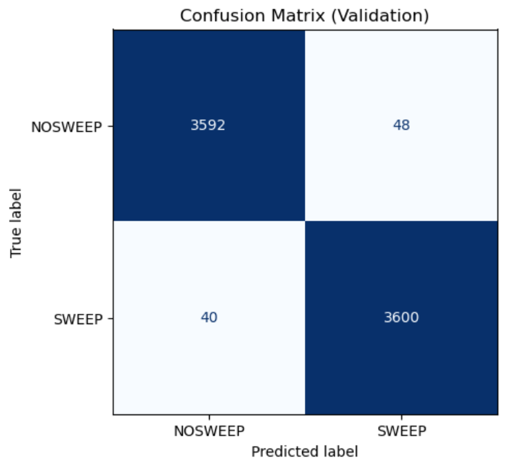

# Sweep Detection with CNNs

This repository implements a pipeline for detecting **selective sweeps** from population genetic data using **Convolutional Neural Networks (CNNs)**.  
The approach is partially inspired by *The Unreasonable Effectiveness of Convolutional Neural Networks in Population Genetic Inference* (Flagel, Brandvain, & Schrider, 2018).  
[Full paper here](https://doi.org/10.1093/molbev/msy224)

---

## Prerequisites

Before running the pipeline, make sure you have:

1. Access to a High-Performance Computing (HPC) environment with **SLURM** scheduling.  
2. [discoal](https://github.com/kern-lab/discoal) cloned and compiled on the HPC (used for simulating population genetic data).  
3. Python environment with:
   - `torch`, `torchvision`  
   - `numpy`, `pandas`, `PIL`  
   - `scikit-learn`  

---

## Repository Structure

Each step of the pipeline is represented by a `.py` script (Python logic) and its corresponding `.sl` script (SLURM job).  
Helper `.txt` files show how to invoke them.

GHIST_2025_singlesweep.21.testing.vcf.gz <- example input VCF
GHIST_2025_singlesweep.21.w100k.minimal.csv <- windowed SNPs + thetaW + rho
cnn_train_ss.py <- CNN training script
predict_ss.py <- CNN prediction script
discoal_ms_from_windows.py <- simulate ms files from windows
ms_to_png_fixed.py <- convert ms output to PNG images
vcf_to_png_fixed.py <- convert VCF to PNG images
run_discoal_ms.sl <- SLURM job for discoal simulations
run_cnn_train.sl <- SLURM job for CNN training
predict_ss.sl <- SLURM job for predictions


---

## Pipeline Steps

### 1. Simulation
Generate `.ms` simulation files from real genomic windows:
```bash
sbatch run_discoal_ms.sl
```

### 2. Convert Simulation to Images
Turn `.ms` files into alignment images:
```bash
python ms_to_png_fixed.py --ms <file.ms> --outdir ms_png
```

### 3. Train CNN
Train sweep vs. non-sweep classifier on the generated images:
```bash
sbatch run_cnn_train.sl
```

### 4. Prediction
Apply the trained CNN model to new images:
```bash
sbatch predict_ss.sl
```
---

### Confusion Matrix (Validation)



Note: In the GHIST competition, the true labels for the final test set are not provided.  
Therefore, we can only evaluate model performance on the validation split.  
Here, 10% of the simulated data (`val_frac=0.1`) was held out as a validation set,  
and the confusion matrix above reflects the model’s performance on that portion.

---

## Limitations
1. Currently supports single-sweep detection only.
2. Workflow requires multiple manual steps instead of a single streamlined pipeline.

---

## Future Directions
1. Compact Workflow: integrate simulation → image generation → CNN training → prediction into one script/workflow.
2. Expand Sweep Types: extend to soft sweeps, partial sweeps, and background selection.

---
